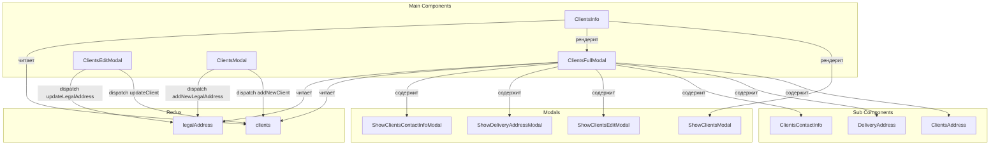

# Управление клиентами (Clients Management)

## Обзор

Комплекс компонентов для управления клиентской базой. Включает:

- Просмотр списка клиентов с фильтрацией
- Добавление новых клиентов
- Редактирование существующих клиентов
- Управление юридическими адресами
- Управление контактной информацией
- Управление адресами доставки

## Схема взаимодействия компонентов



---

## Компонент 1: ClientsInfo

### Роль в системе

Главный компонент для отображения списка клиентов. Отвечает за:

- Отображение таблицы клиентов
- Фильтрацию и трансформацию данных (категории, ценовые категории)
- Открытие карточки клиента при клике
- Управление правами доступа

### Зависимости

| Источник          | Назначение                                             |
| ----------------- | ------------------------------------------------------ |
| `ProjectContext`  | Данные клиентов, конфигурация таблицы, опции категорий |
| `UsersContext`    | Права доступа пользователя                             |
| `Redux (clients)` | Данные клиентов из хранилища                           |

### Ключевая логика

#### Трансформация данных клиента

```javascript
useEffect(() => {
  if (clients) {
    const newData = clients.map((client) => ({
      ...client,
      category:
        categoryOptions.find((option) => option.value == client.category)
          ?.label || client.category,
      price_category:
        priceCategoryOptions.find(
          (option) => option.value == client.price_category,
        )?.label || client.price_category,
    }));
    setClientsDataList(newData);
  }
}, [clients]);
```

#### Обработчик клика по клиенту

```javascript
const clientHandler = (id) => {
  const client = clients.find((el) => el.id === id);
  setCurrentClient(client);
  setModalShow(true);
};
```

### Структура данных

```javascript
{
    id: number,                    // ID клиента
    c_name: string,                // Название клиента
    cif_vat: string,               // CIF/VAT номер
    category: string,              // Категория клиента
    price_category: string         // Ценовая категория
}
```

### Пример использования

```jsx
import ClientsInfo from '#components/Clients/ClientsInfo/ClientsInfo';

function ClientsPage() {
  return <ClientsInfo />;
}
```

---

## Компонент 2: ClientsFullModal (MydModalWithGrid)

### Роль в системе

Модальное окно с полной информацией о клиенте ("карточка клиента"). Отвечает за:

- Отображение всех данных клиента
- Интеграцию дочерних компонентов (адреса, контакты)
- Предоставление кнопок редактирования

### Структура модального окна

```jsx
<Modal size="lg" scrollable={true}>
  <Modal.Header>Client's card</Modal.Header>
  <Modal.Body>
    <Container>
      {/* Основная информация */}
      <h3>{currentClient?.c_name}</h3>
      <p>CIF/VAT: {currentClient?.cif_vat}</p>
      <p>Category: {currentClient?.category}</p>
      <p>Price category: {currentClient?.price_category}</p>

      {/* Дочерние компоненты */}
      <ClientsAddress />
      <DeliveryAddress />
      <ClientsContactInfo />
    </Container>
  </Modal.Body>
</Modal>
```

### Вложенные компоненты

| Компонент                     | Назначение                        |
| ----------------------------- | --------------------------------- |
| `ClientsAddress`              | Отображение юридического адреса   |
| `DeliveryAddress`             | Отображение адресов доставки      |
| `ClientsContactInfo`          | Отображение контактной информации |
| `ShowClientsEditModal`        | Кнопка редактирования клиента     |
| `ShowDeliveryAddressModal`    | Кнопка добавления адреса доставки |
| `ShowClientsContactInfoModal` | Кнопка добавления контакта        |

---

## Компонент 3: ClientsEditModal

### Роль в системе

Модальное окно редактирования клиента. Отвечает за:

- Редактирование основной информации клиента
- Редактирование юридического адреса
- Валидацию и отправку изменений

### Форма редактирования

#### Основная информация клиента

| Поле           | Тип    | Описание          |
| -------------- | ------ | ----------------- |
| Client's Name  | text   | Название клиента  |
| CIF/VAT        | text   | Налоговый номер   |
| Category       | select | Категория клиента |
| Price category | select | Ценовая категория |

#### Юридический адрес

| Поле            | Тип   | Описание                  |
| --------------- | ----- | ------------------------- |
| Street          | text  | Улица                     |
| Additional info | text  | Дополнительная информация |
| City            | text  | Город                     |
| ZIP code        | text  | Почтовый индекс           |
| Province        | text  | Провинция                 |
| Country         | text  | Страна                    |
| Phone office    | phone | Телефон офиса             |
| Fax             | phone | Факс                      |
| Mobile          | phone | Мобильный телефон         |
| Web link        | text  | Веб-сайт                  |
| email           | email | Email адрес               |

### Ключевая логика

#### Отправка изменений

```javascript
const onSubmitForm = async (e) => {
  e.preventDefault();

  // Обновление клиента
  dispatch(
    updateClient({
      client: {
        c_id: currentClient.id,
        c_name,
        cifvat,
        category,
        price_category: priceCategory,
      },
    }),
  );

  // Обновление юридического адреса
  dispatch(
    updateLegalAddress({
      legalAddress: {
        c_id: currentClient.id,
        street,
        additional_info,
        city,
        zip_code,
        province,
        country,
        phone_office,
        fax,
        phone_mobile,
        web_link,
        c_email,
      },
    }),
  );

  props.onHide();
};
```

---

## Компонент 4: ClientsModal (Add Client)

### Роль в системе

Модальное окно добавления нового клиента. Отвечает за:

- Создание нового клиента
- Добавление юридического адреса
- Валидацию полей (особенно ZIP кода)

### Форма добавления клиента

```jsx
<form id="addClientModel" onSubmit={onSubmitForm}>
  {/* Информация о клиенте */}
  {clients_info_table.map((el) =>
    el.accessor === 'category' ? (
      <Select options={categoryOptions} />
    ) : el.accessor === 'price_category' ? (
      <Select options={priceCategoryOptions} />
    ) : (
      <input name={el.accessor} />
    ),
  )}

  {/* Юридический адрес */}
  {clients_legal_address_table.map((el) =>
    el.accessor === 'phone_office' ? (
      <PhoneInput />
    ) : el.accessor === 'zip_code' ? (
      <input pattern="[0-9]*" />
    ) : (
      <input name={el.accessor} />
    ),
  )}
</form>
```

### Валидация ZIP кода

```javascript
const regexp = new RegExp(`^[0-9]*$`);
const isValid = (value) => value !== '' && value !== '-';

<input
  className={valid ? '' : 'invalid'}
  onKeyPress={(e) => !/[0-9]/.test(e.key) && e.preventDefault()}
  onChange={(e) => {
    if (regexp.test(e.target.value)) {
      handleClientLegalAddressInputChange(e);
    }
  }}
/>;
```

### Отправка нового клиента

```javascript
const onSubmitForm = async (e) => {
  e.preventDefault();

  dispatch(addNewClient({ client: clientInput }));
  dispatch(addNewLegalAddress({ legalAddress: clientLegalAddressInput }));

  props.onHide();
  setClientInput({});
  setClientLegalAddressInput({});
};
```

---

## Права доступа

Все компоненты используют систему прав из `UsersContext`:

```javascript
useEffect(() => {
  if (user && roles.length > 0) {
    const access = checkUserAccess(user, roles, 'Clients');
    setUserAccess(access);

    if (!access?.canRead) {
      navigate('/');
    }
  }
}, [user, roles]);
```

| Право      | Назначение                           |
| ---------- | ------------------------------------ |
| `canRead`  | Просмотр списка клиентов и карточек  |
| `canWrite` | Добавление и редактирование клиентов |

---

## Визуальное представление

```
┌─────────────────────────────────────────────────────────────────────────┐
│                           Clients Management                             │
├─────────────────────────────────────────────────────────────────────────┤
│                                                              [Add Client] │
├───────────┬───────────────┬──────────┬────────────────┬────────────────┤
│ ID        │ Client Name   │ CIF/VAT  │ Category       │ Price Category │
├───────────┼───────────────┼──────────┼────────────────┼────────────────┤
│ 1         │ ACME Corp     │ B12345678│ Distributor    │ Premium        │
│ 2         │ Beta Ltd      │ B87654321│ Retail         │ Standard       │
└───────────┴───────────────┴──────────┴────────────────┴────────────────┘

При клике на строку открывается карточка клиента:

┌─────────────────────────────────────────────────────────────────────────┐
│                         Client's card                            [X]    │
├─────────────────────────────────────────────────────────────────────────┤
│ ACME Corp                                                               │
│ CIF/VAT: B12345678                                                      │
│ Category: Distributor                                                   │
│ Price category: Premium                                                 │
│                                                              [Edit Client]│
├─────────────────────────────────────────────────────────────────────────┤
│ ┌─────────────────────────┐ ┌─────────────────────────────────────────┐│
│ │ Legal Address           │ │ Actions                                 ││
│ │ Calle Principal 123     │ │ [Add Delivery Address]                  ││
│ │ Madrid, 28001           │ │ [Add Contact Info]                      ││
│ │ Spain                   │ │                                         ││
│ └─────────────────────────┘ └─────────────────────────────────────────┘│
│                                                                         │
│ Delivery Addresses:                                                     │
│ ┌─────────────────────────────────────────────────────────────────────┐│
│ │ Calle Secundaria 456, Barcelona, 08001                              ││
│ └─────────────────────────────────────────────────────────────────────┘│
│                                                                         │
│ Contact Information:                                                    │
│ ┌─────────────────────────────────────────────────────────────────────┐│
│ │ Juan Pérez │ juan@acme.com │ +34 91 234 56 78                       ││
│ └─────────────────────────────────────────────────────────────────────┘│
├─────────────────────────────────────────────────────────────────────────┤
│                                                              [Close]    │
└─────────────────────────────────────────────────────────────────────────┘
```

---

## API компонентов

### ClientsInfo

| Проп        | Тип | Описание             |
| ----------- | --- | -------------------- |
| Нет пропсов | -   | Использует контексты |

### ClientsFullModal

| Проп     | Тип        | Описание                  |
| -------- | ---------- | ------------------------- |
| `show`   | `boolean`  | Открыто ли модальное окно |
| `onHide` | `function` | Функция закрытия          |

### ClientsEditModal

| Проп     | Тип        | Описание                  |
| -------- | ---------- | ------------------------- |
| `show`   | `boolean`  | Открыто ли модальное окно |
| `onHide` | `function` | Функция закрытия          |

### ClientsModal

| Проп     | Тип        | Описание                  |
| -------- | ---------- | ------------------------- |
| `show`   | `boolean`  | Открыто ли модальное окно |
| `onHide` | `function` | Функция закрытия          |

---

## Импорты

```javascript
// Основной компонент
import ClientsInfo from '#components/Clients/ClientsInfo/ClientsInfo';

// Модальные окна
import ShowClientsModal from '#components/Clients/ClientsInfo/ClientsInfoModal';
import ShowClientsEditModal from '#components/Clients/ClientsInfo/ClientsInfoEditModal';
import MydModalWithGrid from '#components/Clients/ClientsInfo/ClientFullModal';

// Дочерние компоненты
import ClientsAddress from '#components/Clients/ClientsAddress/ClientsAddress';
import DeliveryAddress from '#components/Clients/DeliveryAddress/DeliveryAddress';
import ClientsContactInfo from '#components/Clients/ClientsContactInfo/ClientsContactInfo';
```

---

## Связанные компоненты

- [`ClientsAddress`](02-components/05-clients/ClientsAddress) - управление юридическими адресами
- [`DeliveryAddress`](02-components/05-clients/DeliveryAddress) - управление адресами доставки
- [`ClientsContactInfo`](02-components/05-clients/ClientsContactInfo) - управление контактами

---

## Планы по развитию

- [ ] Добавить поиск и фильтрацию клиентов
- [ ] Реализовать экспорт списка клиентов
- [ ] Добавить импорт клиентов из Excel
- [ ] Поддержка истории изменений клиентов
- [ ] Добавить возможность деактивации клиентов
