# OrderCart

## Роль в системе

Основной компонент для управления конкретным заказом. Отвечает за:

- Отображение полной информации о заказе (клиент, контакты, адрес доставки)
- Управление статусами заказа с валидацией переходов
- Резервирование товаров на складе при подтверждении заказа
- Управление продуктами в заказе (блоки, сухие смеси, анкеры, инструменты, сопутствующие материалы)
- Расчет НДС и итоговой стоимости
- Управление файлами, прикрепленными к заказу
- Генерацию PDF-документа заказа

## Схема взаимодействия

```mermaid
graph TB
    subgraph Contexts
        OC[OrderContext]
        PC[ProductsContext]
        WC[WarehouseContext]
        MC[ModalContext]
        UC[UsersContext]
        PJ[ProductsTypeJournalContext]
        PR[ProjectContext]
    end

    subgraph Redux
        ORD[ordersAction]
        WAR[warehouseAction]
        PTW[productsTypeWarehouseAction]
        RBL[relatedMaterialsBackorderListAction]
        RES[reservedProducts]
    end

    subgraph Components
        OCART[OrderCart]
        BLK[BlocksJournalTableOrder]
        DRY[DryMixesJournalTableOrder]
        ANC[AnchorJournalTableOrder]
        TOL[ToolJournalTableOrder]
        REL[RelatedMaterialJournalTableOrder]
        FILES[FilesMain]
        PDF[PDFgenerate]
    end

    OCART --> |использует| OC
    OCART --> |использует| PC
    OCART --> |использует| WC
    OCART --> |использует| MC
    OCART --> |использует| UC
    OCART --> |использует| PJ
    OCART --> |использует| PR
    OCART --> |dispatch| ORD
    OCART --> |dispatch| WAR
    OCART --> |dispatch| PTW
    OCART --> |dispatch| RBL
    OCART --> |рендерит| BLK
    OCART --> |рендерит| DRY
    OCART --> |рендерит| ANC
    OCART --> |рендерит| TOL
    OCART --> |рендерит| REL
    OCART --> |рендерит| FILES
    OCART --> |рендерит| PDF
```



## Зависимости

### Contexts

| Источник                     | Назначение                                                   |
| ---------------------------- | ------------------------------------------------------------ |
| `OrderContext`               | Данные заказа, статусы, список продуктов, ответственные лица |
| `ProductsContext`            | Справочник продуктов (блоки)                                 |
| `WarehouseContext`           | Данные склада, резервирование                                |
| `ModalContext`               | Управление модальными окнами                                 |
| `UsersContext`               | Права доступа пользователя                                   |
| `ProductsTypeJournalContext` | Справочники (сухие смеси, анкеры, инструменты)               |
| `ProjectContext`             | Отображение имен полей, данные пользователя                  |

### Redux Actions

| Action                            | Назначение                                     |
| --------------------------------- | ---------------------------------------------- |
| `addDescription`                  | Добавление/изменение описания заказа           |
| `addDataShipOrder`                | Установка даты отгрузки                        |
| `updateOrderStatus`               | Изменение статуса заказа                       |
| `updateOrderInCharge`             | Смена ответственного лица                      |
| `deleteOrder`                     | Удаление заказа                                |
| `getDeleteProductOfOrder`         | Удаление продукта из заказа                    |
| `addNewListOfOrderedProduction`   | Добавление в список заказанной продукции       |
| `updateRemainingStock`            | Обновление остатков на складе                  |
| `updateDryMixesWarehouse`         | Обновление остатков сухих смесей               |
| `updateAnchorsWarehouse`          | Обновление остатков анкеров                    |
| `updateToolsWarehouse`            | Обновление остатков инструментов               |
| `updateRelatedMaterialsWarehouse` | Обновление остатков сопутствующих материалов   |
| `addNewRelatedMaterialsBackorder` | Добавление в бэк-ордер                         |
| `updAccountingDataList`           | Обновление статуса бухгалтерского согласования |
| `deleteAccountingData`            | Удаление бухгалтерских данных                  |
| `addNewDeliveryPrice`             | Добавление стоимости доставки                  |
| `addSecondaryContact`             | Добавление вторичного контакта                 |
| `delSecondaryContact`             | Удаление вторичного контакта                   |

## Статусы заказа

Компонент использует статусы из `OrderContext` (`status_list`):

| Accessor | Статус                  | Описание                |
| -------- | ----------------------- | ----------------------- |
| 1        | Новый                   | Заказ создан            |
| 2        | В обработке             | Назначен ответственный  |
| 3        | Согласован              | Бухгалтерия подтвердила |
| 4        | Готов к отгрузке        | Товар зарезервирован    |
| 5        | Отгружен                | Заказ отправлен         |
| 6        | Разрешен к производству | Для OEM продукции       |
| 7        | Отменен                 | Заказ отменен           |
| 9        | Закрыт                  | Заказ завершен          |
| 10       | Удален                  | Заказ удален            |

### Правила перехода между статусами

```javascript
// Проверка возможности перехода
if (
  status.accessor < orderCartData?.status ||
  status.accessor > orderCartData?.status + 1
) {
  return alert('This status cannot be set');
}

// Проверка бухгалтерского согласования для статуса 3
if (!aproveAccounting) {
  return alert("Please await accounting's verification");
}

// Проверка даты отгрузки для статуса 4+
if (status.accessor > status_list[3].accessor && !hasShippingDate) {
  alert('Please select the shipping date.');
  return;
}
```

## Ключевая логика

### Резервирование товаров на складе

При переходе в статус "Готов к отгрузке" (accessor 5) происходит резервирование товаров:

```javascript
// Для каждого типа продуктов своя логика резервирования
updatedProductListOrder?.forEach((product) => {
  const loc = latestProducts.find(
    (el) => el.article == product.product_article,
  )?.placeOfProduction;

  if (status.accessor === status_list[5].accessor && loc === 'Spain') {
    // Поиск существующего резерва
    const haveProductReserve = list_of_reserved_products.find(
      (el) => el.orders_products_id == product.id,
    );

    if (!haveProductReserve) {
      // Резервирование со склада
      let remainingToAllocate = reservedProduct.quantity_palet;

      for (const warehouseItem of matchingWarehouseProducts) {
        if (
          remainingToAllocate > 0 &&
          warehouseItem.free_quantity_remaining > 0
        ) {
          const taken = Math.min(
            warehouseItem.free_quantity_remaining,
            remainingToAllocate,
          );

          // Обновление остатков на складе
          dispatch(
            updateRemainingStock({
              warehouse_id: warehouseItem.id,
              free_quantity_remaining:
                warehouseItem.free_quantity_remaining - taken,
              ordered_quantity: (warehouseItem.ordered_quantity || 0) + taken,
            }),
          );

          remainingToAllocate -= taken;
        }
      }

      // Создание записи в списке заказанной продукции
      dispatch(
        addNewListOfOrderedProduction({
          shipping_date: orderCartData?.shipping_date,
          product_article: product?.product_article,
          order_article: orderCartData?.article,
          quantity: product?.quantity_palet,
          quantity_in_warehouse,
        }),
      );
    }
  }
});
```

### Типы продуктов и их идентификация

Компонент поддерживает 5 типов продуктов:

| Префикс артикула | Тип                     | Таблица                    | Поле ID        |
| ---------------- | ----------------------- | -------------------------- | -------------- |
| `T...`           | Блоки (products)        | `productsOfOrders`         | `product_id`   |
| `..M`            | Сухие смеси             | `dryMixedProductsOfOrders` | `dry_mixed_id` |
| `..F`            | Анкеры                  | `anchorProductsOfOrders`   | `anchor_id`    |
| `..T`            | Инструменты             | `toolProductsOfOrders`     | `tool_id`      |
| `..P`            | Сопутствующие материалы | `relMatProductsOfOrders`   | `rel_mat_id`   |

**Функция определения типа:**

```javascript
const onProductClickHandler = (sel_prod) => {
  const prefix = sel_prod.product_article.slice(2, 3);

  const product =
    prefix == 'N'
      ? latestProducts.find((el) => el.article === sel_prod.product_article)
      : prefix == 'M'
        ? latestDryMix.find((el) => el.article === sel_prod.product_article)
        : prefix == 'P'
          ? latestRelatedMaterials.find(
              (el) => el.article === sel_prod.product_article,
            )
          : prefix == 'F'
            ? latestAnchors.find(
                (el) => el.article === sel_prod.product_article,
              )
            : latestTools.find((el) => el.article === sel_prod.product_article);
};
```

### Расчет НДС

```javascript
const final_price_product = useMemo(() => {
  const allProducts = [
    ...productLists['products'],
    ...productLists['dryMixes'],
    ...productLists['anchors'],
    ...productLists['tools'],
    ...productLists['related_materials'],
  ];

  return allProducts.reduce(
    (acc, el) =>
      acc +
      (el?.final_price ||
        el?.final_price_dry ||
        el?.final_price_anchor ||
        el?.final_price_tool ||
        el?.final_price_rel_mat ||
        0),
    0,
  );
}, [productLists]);

useEffect(() => {
  const vat_euro = (vatValue.vat_procent * final_price_product) / 100;
  const vat_result = final_price_product + vat_euro;
  const vat_result_del = orderCartData?.delivery
    ? vat_result + orderCartData?.delivery
    : 0;

  setVatValue({
    vat_euro_origin: final_price_product,
    vat_result,
    vat_euro,
    vat_result_del,
  });
}, [final_price_product, vatValue.vat_procent]);
```

### Обработка даты отгрузки

```javascript
const handleDateChange = (date) => {
  const currentDate = new Date();

  // Валидация: дата не может быть раньше текущей
  if (date < currentDate) {
    alert('The selected date cannot be before than the current date');
    return;
  }

  setDataValue(date);
  const formattedDate = date.toLocaleDateString('ru-RU', {
    year: 'numeric',
    month: '2-digit',
    day: '2-digit',
  });
  setFormatDataValue(formattedDate);
};

// Расчет дней до отгрузки
const handleDayBeforShipping = useCallback(() => {
  const currentDate = new Date();
  const shippingDateString = orderCartData?.shipping_date;
  const shippingDate = new Date(
    shippingDateString.split('.').reverse().join('-'),
  );
  const timeDiff = shippingDate.getTime() - currentDate.getTime();
  const daysUntil = Math.ceil(timeDiff / (1000 * 3600 * 24));
  return daysUntil;
}, [orderCartData?.shipping_date]);
```

## Права доступа

Компонент использует систему прав доступа из `UsersContext`:

| Право                            | Назначение                    |
| -------------------------------- | ----------------------------- |
| `Orders`                         | Общий доступ к заказам        |
| `Orders_status`                  | Изменение статусов заказов    |
| `Del_orders`                     | Удаление заказов              |
| `orders_description_edit`        | Редактирование описания       |
| `orders_change_person_in_charge` | Смена ответственного лица     |
| `orders_save_delivery_price`     | Сохранение стоимости доставки |

```javascript
useEffect(() => {
  if (user && roles.length > 0) {
    const access = checkUserAccess(user, roles, 'Orders');
    setUserAccess(access);

    const statusAccess = checkUserAccess(user, roles, 'Orders_status');
    setOrderStatusAccess(statusAccess);

    const deleteAccess = checkUserAccess(user, roles, 'Del_orders');
    setDeleteOrderAccess(deleteAccess);

    if (!access?.canRead) {
      navigate('/');
    }
  }
}, [user, roles]);
```

## Управление продуктами в заказе

### Добавление артикулов к продуктам

Функция `addProductArticleToOrderList` обогащает данные продуктов информацией из справочников:

```javascript
const addProductArticleToOrderList = useCallback(
  (productsOfOrders, productsTable, arrayName) => {
    if (!productsOfOrders || !productsTable || !arrayName || !orderCartData?.id)
      return [];

    const updatedOrderProducts = productsOfOrders
      .filter((el) => el.order_id == orderCartData.id)
      .map((orderProduct) => {
        const id = getCorrectProductId(arrayName);
        const product = productsTable.find((p) => p.id === orderProduct?.[id]);

        return product
          ? {
              product_article: product.article,
              description: getDescriptionByType(arrayName, product),
              ...orderProduct,
            }
          : { ...orderProduct, product_article: 'Unknown' };
      });

    return updatedOrderProducts;
  },
  [orderCartData?.id],
);
```

### Удаление продукта из заказа

```javascript
const deleteHandler = (product) => {
  // Проверка на наличие резерва
  const res_prod = list_of_reserved_products.find((el) => el.id === product.id);

  if (res_prod) alert('Этот продукт зарезервирован на складе');

  // Выбор правильного action на основе типа продукта
  if (product?.product_article.charAt(0) === 'T') {
    dispatch(getDeleteProductOfOrder(product?.id));
  } else if (product?.product_article.charAt(2) === 'M') {
    dispatch(getDeleteDryMixedProductOfOrder(product?.id));
  } else if (product?.product_article.charAt(2) === 'F') {
    dispatch(getDeleteAnchorProductOfOrder(product?.id));
  } else if (product?.product_article.charAt(2) === 'T') {
    dispatch(getDeleteToolProductOfOrder(product?.id));
  } else if (product?.product_article.charAt(2) === 'P') {
    dispatch(getDeleteRelMatProductOfOrder(product?.id));
  }
};
```

## Структура данных

### OrderCartData

```javascript
{
    id: number,                    // ID заказа
    article: string,               // Номер заказа
    status: number,                // Текущий статус (1-10)
    description: string,           // Описание заказа
    shipping_date: string,         // Дата отгрузки (DD.MM.YYYY)
    delivery: number,              // Стоимость доставки
    person_in_charge: string,      // Ответственное лицо
    owner: {                       // Информация о клиенте
        id: number,
        name: string,
        // ... другие поля
    },
    contactInfo: {                 // Контактное лицо
        name: string,
        phone: string,
        email: string
    },
    deliveryAddress: {             // Адрес доставки
        address: string,
        city: string,
        country: string
    },
    secondaryContact: {            // Вторичный контакт (опционально)
        name: string,
        phone: string,
        email: string
    }
}
```

### ProductLists

```javascript
{
    products: [],              // Блоки
    dryMixes: [],              // Сухие смеси
    anchors: [],               // Анкеры
    tools: [],                 // Инструменты
    related_materials: []      // Сопутствующие материалы
}
```

## Вложенные компоненты

| Компонент                             | Назначение                             |
| ------------------------------------- | -------------------------------------- |
| `BlocksJournalTableOrder`             | Таблица блоков в заказе                |
| `DryMixesJournalTableOrder`           | Таблица сухих смесей в заказе          |
| `AnchorJournalTableOrder`             | Таблица анкеров в заказе               |
| `ToolJournalTableOrder`               | Таблица инструментов в заказе          |
| `RelatedMaterialJournalTableOrder`    | Таблица сопутствующих материалов       |
| `FilesMain`                           | Управление файлами заказа              |
| `PDFgenerate`                         | Генерация PDF-документа                |
| `ShowOrderContactEditModal`           | Модальное окно редактирования контакта |
| `ShowOrderDeliveryEditModal`          | Модальное окно редактирования адреса   |
| `OrderProductCardInfoModal`           | Информация о продукте                  |
| `ListOfReservedProductsModal`         | Список зарезервированных продуктов     |
| `ListOfOrderedProductionReserveModal` | Детали резервирования                  |

## Пример использования

```jsx
import OrderCart from '#components/Orders/OrderCart';

function OrderPage() {
  return (
    <OrderContextProvider>
      <ProductsContextProvider>
        <WarehouseContextProvider>
          <OrderCart />
        </WarehouseContextProvider>
      </ProductsContextProvider>
    </OrderContextProvider>
  );
}
```

## Важные замечания

### Бухгалтерское согласование

- Статус 3 ("Согласован") доступен только после подтверждения бухгалтерии
- Флаг `aproveAccounting` отслеживается из `accountingDataList`
- При отмене или закрытии заказа бухгалтерские данные обновляются

### Локальное хранение

```javascript
useEffect(() => {
  const storedData = localStorage.getItem('orderCartData')
    ? JSON.parse(localStorage.getItem('orderCartData'))
    : null;

  if (storedData) {
    setOrderCartData(storedData);
  }

  localStorage.setItem('orderCartData', JSON.stringify(storedData));
}, [list_of_orders]);
```

### Особенности резервирования

- Товары со склада в Испании резервируются через `addNewListOfOrderedProduction`
- Товары OEM резервируются через `addNewListOfOrderedProductionOEM`
- Для каждого типа продуктов используется свой warehouse-массив

### Оптимизация

Компонент обернут в `React.memo()` для предотвращения лишних перерендеров

## Связанные компоненты

- [`ProductionBatchDesignerNew`](02-components/01-production/ProductionBatchDesignerNew) - производственное планирование
- [`OrdersTable`](02-components/02-orders/OrdersTable) - список заказов
- [`FilesMain`](02-components/03-uploads/FilesMain) - управление файлами
