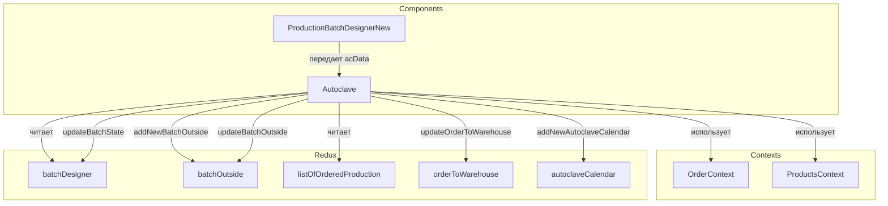

# Autoclave

## Роль в системе

Визуализация и управление заполнением автоклавов. Отвечает за:

- Отображение сетки автоклавов (21 ячейка на автоклав)
- Drag-and-drop (через кнопки) размещение массивов
- Синхронизацию с Redux и контекстом
- Сохранение результатов производства

## Схема взаимодействия



## Зависимости

| Источник                  | Тип     | Назначение                            |
| ------------------------- | ------- | ------------------------------------- |
| `OrderContext`            | Context | Состояние автоклавов, batchOrderIDs   |
| `ProductsContext`         | Context | Справочник продуктов                  |
| `batchDesigner`           | Redux   | Данные о батчах (количество массивов) |
| `batchOutside`            | Redux   | История произведенных батчей          |
| `listOfOrderedProduction` | Redux   | Заказы на производство                |
| `orderToWarehouse`        | Redux   | Заказы на складе                      |

## Ключевая логика

### Архитектурный паттерн: Single Source of Truth

Компонент реализует важный паттерн - синхронизацию через flat-представление. Функция `syncFromAutoclave` использует плоский массив ячеек как единственный источник правды:

```javascript
const syncFromAutoclave = (rows) => {
  // 1. Преобразуем 2D → 1D для подсчета
  const flat = rows.flat();

  // 2. Считаем количество ячеек каждого батча
  const counts = new Map();
  for (const c of flat) {
    if (c?.id) counts.set(c.id, (counts.get(c.id) || 0) + 1);
  }

  // 3. Обновляем Redux для каждого батча
  for (const b of batchDesigner) {
    const inBatch = counts.get(b.id) || 0;
    dispatch(
      updateBatchState({
        id: b.id,
        cakes_in_batch: inBatch,
        cakes_residue: b.total_cakes - inBatch,
      }),
    );
  }

  // 4. Обновляем производные данные в контексте
  setQuantityPallets((prev) => {
    const next = { ...prev };
    for (const id of counts.keys()) {
      next[id] = counts.get(id) * 3;
    }
    return next;
  });

  setBatchOrderIDs(Array.from(counts.keys()));
};
```

### Константы и хелперы

```javascript
const CELLS_PER_AUTOCLAVE = 21;
const EMPTY_CELL = { id: null, density: '', width: '', article: '' };

const isEmpty = (c) => !c || c.id === null;

const toFlat = (rows) => {
  const flat = Array.isArray(rows) ? rows.flat() : [];
  return flat.map((c) => {
    if (!c || c.id == null) return { ...EMPTY_CELL };
    return {
      id: c.id ?? null,
      density: c.density ?? '',
      width: c.width ?? '',
      article: c.article ?? '',
    };
  });
};
```

### Операции с автоклавами

#### Добавление массива (`addArrayAfterSelected`)

```javascript
const addArrayAfterSelected = () => {
  // 1. Найти последний элемент того же артикула (tail)
  // 2. Вставить новый элемент сразу после tail
  // 3. Удалить последний пустой элемент для сохранения размера
  // 4. Перестроить ряды
};
```

**Логика выбора source ID для добавления:**

```javascript
const pickSourceIdForAdd = (preferId) => {
  const ids = getGroupIds(preferId);
  if (!ids.length) return preferId;

  const hasUnplaced = ids.some((sid) => getResidueById(sid) > 0);
  const ascByDate = [...ids].sort((a, b) => shipTs(a) - shipTs(b));

  if (hasUnplaced) {
    // Берем первый неразмещенный по дате отгрузки
    for (const sid of ascByDate) if (getResidueById(sid) > 0) return sid;
    return ascByDate[0];
  }
  // Если всё размещено - добавляем к последнему по отгрузке
  return ascByDate[ascByDate.length - 1];
};
```

#### Удаление массива (`deleteOneArrayOfSelected`)

```javascript
const deleteOneArrayOfSelected = () => {
  // 1. Найти последний элемент с выбранным артикулом
  // 2. Заменить его на пустую ячейку
  // 3. Скомпактировать (сдвинуть все заполненные ячейки влево)
};
```

#### Заполнение до конца ряда (`fillToRowEnd`)

```javascript
const fillToRowEnd = () => {
  // 1. Найти позицию последнего элемента артикула
  // 2. Определить конец текущего ряда
  // 3. Последовательно заполнять пустые ячейки до конца ряда
  // 4. При необходимости сдвигать существующие элементы
};
```

#### Перемещение партии позже (`moveBatchLater`)

```javascript
const moveBatchLater = () => {
  // 1. Разделить массив на группу и остальные
  // 2. Найти последнюю заполненную ячейку
  // 3. Проверить достаточно ли места после нее
  // 4. Вставить группу после последней заполненной
};
```

### Сохранение результатов

Комплексная операция `saveOnServer`:

```javascript
const saveOnServer = (filledCount) => {
  // 1. Обновить календарь автоклавов
  const producedDelta = Math.ceil(filledCount / CELLS_PER_AUTOCLAVE);
  dispatch(
    addNewAutoclaveCalendar([
      {
        quantity,
        date,
        produced_autoclave: produced_autoclave + producedDelta,
      },
    ]),
  );

  // 2. Собрать все ID в порядке их расположения
  const flat = toFlat(autoclave);
  const idsInOrder = [];
  for (const c of flat) {
    if (c?.id && !idsInOrder.includes(c.id)) idsInOrder.push(c.id);
  }

  // 3. Рассчитать позиции в батче
  let positionInBatch = 1;
  const batchPositions = idsInOrder
    .map((id) => {
      const product = batchDesigner.find((p) => p.id === id);
      if (!product) return null;
      const pos = { product, positionInBatch };
      positionInBatch += Number(product.cakes_in_batch || 0);
      return pos;
    })
    .filter(Boolean);

  // 4. Создать записи в batchOutside
  batchPositions.forEach((position) => {
    const { product } = position;
    const palletsPerArray = calculatePalletsPerArray(product.product_article);

    dispatch(
      addNewBatchOutside({
        product_article: product.product_article,
        quantity_pallets: product.cakes_in_batch * palletsPerArray,
        quantity_free: calculateFreeQuantity(product),
        position_in_autoclave: position.positionInBatch,
        date,
        id_ordered_product_to_warehouse:
          product.id_ordered_product_to_warehouse,
      }),
    );
  });
};
```

## UI/UX особенности

### Цветовая маркировка

Каждый уникальный batch ID получает свой цвет для визуального отслеживания:

```javascript
const assignColorToId = (id) => {
  if (id == null) return 0;
  if (idColorMap[id] !== undefined) return idColorMap[id];
  const nextColor = Object.keys(idColorMap).length % 10;
  setIdColorMap((prevMap) => ({ ...prevMap, [id]: nextColor }));
  return nextColor;
};

const getClassForAutoclave = (num) => {
  const classes = [
    'cell-white', // 0: пусто
    'cell-red', // 1: батч 1
    'cell-green', // 2: батч 2
    'cell-orange', // 3: батч 3
    'cell-black', // 4: батч 4
    'cell-yellow', // 5: батч 5
    'cell-gray', // 6: батч 6
    'cell-purple', // 7: батч 7
    'cell-blue', // 8: батч 8
    'cell-pink', // 9: батч 9
  ];
  return classes[num] || 'cell-white';
};
```

### Визуализация автоклава

```jsx
<div className="autoclave-container">
  {autoclave?.map((autoclaveRow, rowIndex) => (
    <div key={rowIndex} className="autoclave-row">
      <h3 className="autoclave-header">Автоклав {rowIndex + 1}</h3>

      {autoclaveRow?.map((el, cellIndex) => (
        <div
          key={cellIndex}
          className={`autoclave-cell ${getClassForAutoclave(
            assignColorToId(el?.id),
          )}`}
          onClick={() =>
            setSelectedCell({
              id: el?.id,
              article: el?.article,
              density: el?.density,
              width: el?.width,
            })
          }
        >
          {el?.id !== null ? `${el.density}x${el.width}` : ''}
        </div>
      ))}
    </div>
  ))}
</div>
```

## API компонента

### Props

| Prop                    | Тип      | Обязательный | Описание                          |
| ----------------------- | -------- | ------------ | --------------------------------- |
| `acData`                | `Array`  | Да           | Данные для автоклавов (2D массив) |
| `autoclaveCalendarData` | `Object` | Да           | Данные календаря автоклавов       |

### State

| Переменная        | Тип      | Начальное | Описание                                           |
| ----------------- | -------- | --------- | -------------------------------------------------- |
| `selectedCell`    | `Object` | `null`    | Выбранная ячейка `{ id, article, density, width }` |
| `idColorMap`      | `Object` | `{}`      | Маппинг ID батчей на цвета                         |
| `initialRowCount` | `number` | `0`       | Количество рядов автоклавов                        |

## Валидация и безопасность

### Проверка заполненности автоклавов

```javascript
const onSaveHandler = async () => {
  const filledCount = autoclave
    .flat()
    .filter((cell) => cell?.id !== null).length;
  const isAutoclaveInvalid =
    filledCount === 0 || filledCount % CELLS_PER_AUTOCLAVE !== 0;

  if (isAutoclaveInvalid) {
    const override = window.confirm(
      'Autoclave is not fully filled. Override with password?',
    );
    if (!override) return;

    const password = prompt('Enter autoclave password:');
    if (password !== process.env.REACT_APP_PASSWORD_FOR_AUTOCLAVE) {
      alert('Wrong password');
      return;
    }
  }

  saveOnServer(filledCount);
};
```

## Пример использования

```jsx
import Autoclave from '#components/ProductionBatchDesigner/Autoclave';

function ProductionView() {
  const { autoclaveData, calendarData } = useWarehouseContext();

  return (
    <Autoclave acData={autoclaveData} autoclaveCalendarData={calendarData} />
  );
}
```

## Важные замечания

### Производительность

- Используется `useRef` для контроля инициализации (`didInitRef`, `didInitFromPropsRef`)
- `useMemo` для вычисляемых значений (`selectedLabel`)
- Аккуратное копирование объектов при мутациях

### Сложные моменты

1. **Компактификация рядов**: после удаления элементов нужно сдвигать все влево
2. **Перемещение группы**: требует перестроения всего плоского массива
3. **Синхронизация**: эффект с зависимостями `[autoclave, initialRowCount]` критичен для консистентности

### Известные ограничения

- Ограничение на 10 цветов (максимум 10 одновременных батчей в визуализации)
- При большом количестве автоклавов возможны проблемы с производительностью (O(n²) операции)
- Нет поддержки drag-and-drop мышкой (только кнопки)

## Связанные компоненты

- [`ProductionBatchDesignerNew`](02-components/01-production/ProductionBatchDesignerNew) - создает данные для автоклавов
- [`AddOrderedProduct`](02-components/01-production/AddOrderedProduct) - добавляет заказанные продукты в производство

## Планы по развитию

- [ ] Добавить поддержку drag-and-drop
- [ ] Улучшить производительность при больших данных
- [ ] Добавить undo/redo операций
- [ ] Реализовать сохранение состояния сессии
