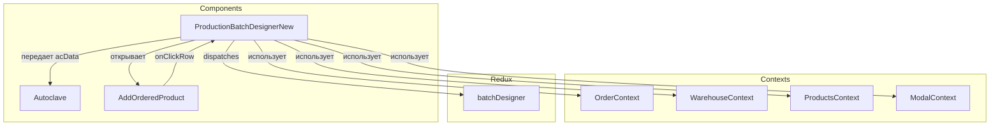

# ProductionBatchDesignerNew

## Роль в системе

Ядро производственного планирования. Отвечает за:

- Отображение очереди заказов на производство
- Расчет потребности в автоклавах (количество массивов)
- Добавление продуктов в производство (как свободных, так и из заказов)
- Координацию между заказами, продуктами и автоклавами

## Схема взаимодействия



## Зависимости

| Источник               | Тип     | Назначение                                                    |
| ---------------------- | ------- | ------------------------------------------------------------- |
| `OrderContext`         | Context | Управление состоянием производственного дизайнера, автоклавов |
| `WarehouseContext`     | Context | Данные о заказанных продуктах и календаре автоклавов          |
| `ProductsContext`      | Context | Справочник продуктов (`latestProducts`)                       |
| `ModalContext`         | Context | Управление модальными окнами                                  |
| `batchDesignerReducer` | Redux   | Хранилище состояния батчей                                    |

## Ключевая логика

### Расчет количества массивов (cakes)

Базовый расчет для всех продуктов:

```javascript
const palletsPerArray = Math.max(
  1,
  Math.floor(Number(m3InArray || 0) / Number(volumeBlockOnPallet || 1)) || 1,
);

const product_with_brack = (
  quantity / palletsPerArray +
  Number(normOfBrack || 0)
).toFixed(2);
const total_cakes = Math.ceil(product_with_brack);
const free_product_cakes = (total_cakes - product_with_brack).toFixed(2);
const free_product_package = Math.floor(free_product_cakes * palletsPerArray);
```

### Обработчики добавления продуктов

#### `addProductHandler(prod_data)`

Добавление свободного продукта в производство:

1. Находит первый свободный слот в автоклавах
2. Рассчитывает количество массивов
3. Создает запись в `batchDesigner`
4. Обновляет состояние автоклавов

#### `addOrderedProductHandler(prod_data)`

Добавление продукта из существующего заказа:

```javascript
const availablePallets =
  quantity_pallets - quantity_allocated - quantity_produced;
// Далее расчет аналогичен addProductHandler
```

### Автоматическое формирование заданий

`useEffect` фильтрует заказы, готовые к производству:

```javascript
const rightListOfOrdered = listOfOrderedCakes.filter((el) => {
  const product = latestProducts.find(
    (prod) => prod.article == el.product_article,
  );
  if (!product) return false;

  const palletsPerArray = Math.max(
    1,
    Math.floor(
      Number(product.m3InArray || 0) / Number(product.volumeBlockOnPallet || 1),
    ) || 1,
  );

  return (
    el.quantity !== el.quantity_in_warehouse &&
    el.quantity >
      el.quantity_in_batch * palletsPerArray + el.quantity_in_warehouse
  );
});
```

## Структура данных

### Группировка по артикулу

Компонент выполняет **двухуровневую группировку** заказов:

```javascript
groupedRow = {
  id: 1,
  product_article: 'ART123',
  quantity: 100,
  product_with_brack: '12.5',
  total_cakes: 13,
  cakes_in_batch: 5,
  cakes_residue: 8,
  free_product_package: 2,
  free_product_cakes: '0.5',
  sources: [
    {
      id: 101,
      total_cakes: 8,
      cakes_in_batch: 3,
      cakes_residue: 5,
    },
    {
      id: 102,
      total_cakes: 5,
      cakes_in_batch: 2,
      cakes_residue: 3,
    },
  ],
};
```

### Состояние автоклавов

```javascript
const CELLS_PER_AUTOCLAVE = 21;

const emptyAutoclave = Array.from(
  { length: autoclaveCount * CELLS_PER_AUTOCLAVE },
  () => ({
    id_list_of_ordered_production: null,
    status: 0,
    quallty_check: 0,
  }),
);
```

## API компонента

### Props (не принимает, использует контексты)

### State

| Переменная                 | Тип       | Назначение                        |
| -------------------------- | --------- | --------------------------------- |
| `totalQuantity`            | `number`  | Общее количество продукции        |
| `acData`                   | `Array`   | Данные для автоклавов             |
| `autoclaveCount`           | `number`  | Количество доступных автоклавов   |
| `autoclaveCalendarData`    | `object`  | Данные календаря автоклавов       |
| `orderedProductBatchModal` | `boolean` | Состояние модального окна заказов |

## Используемые actions

| Action          | Назначение                      |
| --------------- | ------------------------------- |
| `addBatchState` | Добавление нового батча в Redux |

## Пример использования

```jsx
import ProductionBatchDesignerNew from '#components/ProductionBatchDesigner/ProductionBatchDesignerNew';

function App() {
  return (
    <OrderContextProvider>
      <WarehouseContextProvider>
        <ProductsContextProvider>
          <ProductionBatchDesignerNew />
        </ProductsContextProvider>
      </WarehouseContextProvider>
    </OrderContextProvider>
  );
}
```

## Важные замечания

### Разделение ответственности

`ProductionBatchDesignerNew` **не управляет** автоклавами напрямую после инициализации:

1. **Создает** начальную структуру (`emptyAutoclave`)
2. **Передает** ее в `Autoclave` через проп `acData`
3. **Не вмешивается** в дальнейшие манипуляции

### Критические константы

```javascript
const CELLS_PER_AUTOCLAVE = 21; // Количество ячеек в одном автоклаве
const MAX_QUANTITY = 10405; // Максимальное количество продукции
```

### Форматирование даты

```javascript
const formatISO = (s) => {
  if (!s) return '—';
  const [y, m, d] = s.split('-').map(Number);
  const dt = new Date(y, (m || 1) - 1, d || 1);
  return dt.toLocaleDateString('en-GB', {
    day: '2-digit',
    month: 'short',
    year: 'numeric',
  });
};
```

## Связанные компоненты

- [`Autoclave`](02-components/01-production/Autoclave) - визуализация и управление заполнением автоклавов
- [`AddOrderedProduct`](02-components/01-production/AddOrderedProduct) - модальное окно добавления заказанных продуктов
