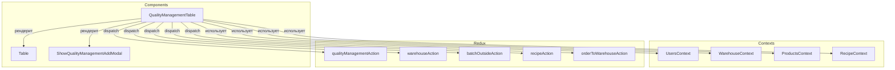
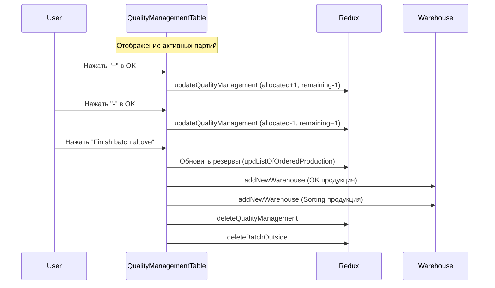

# QualityManagementTable

## Роль в системе

Компонент управления качеством произведенной продукции. Отвечает за:

- Отображение партий, ожидающих контроля качества
- Распределение продукции между категориями (OK / Sorting)
- Завершение партий с автоматическим добавлением на склад
- Резервирование продукции под существующие заказы
- Расчет потребления сырья

## Схема взаимодействия



## Зависимости

### Contexts

| Источник           | Назначение                                        |
| ------------------ | ------------------------------------------------- |
| `UsersContext`     | Права доступа пользователя                        |
| `WarehouseContext` | Календарь автоклавов, список заказанной продукции |
| `ProductsContext`  | Справочник продуктов                              |
| `RecipeContext`    | Расход сырья, рецепты, заказы рецептов            |

### Redux

| Источник                  | Назначение                            |
| ------------------------- | ------------------------------------- |
| `qualityManagementData`   | Данные о партиях на контроле качества |
| `batchOutside`            | Данные о произведенных партиях        |
| `qualityManagementAction` | Действия для управления качеством     |
| `warehouseAction`         | Действия для склада                   |
| `batchOutsideAction`      | Действия для партий                   |
| `recipeAction`            | Действия для рецептов                 |
| `orderToWarehouseAction`  | Действия для заказов на склад         |

## Структура данных

### Колонки таблицы (COLUMNS_QUALITY_MANAGEMENT)

| Колонка                                   | Accessor                      | Описание                         |
| ----------------------------------------- | ----------------------------- | -------------------------------- |
| Batch ID                                  | `batch_id`                    | Идентификатор партии             |
| Product article                           | `product_article`             | Артикул продукта                 |
| Total Qty in batch, plan, pallets         | `total_quantity_plan`         | Плановое количество в партии     |
| Reserved Qty in batch, pallets            | `reserved_quantity`           | Зарезервированное количество     |
| Reserved Qty in batch, allocated, pallets | `reserved_quantity_allocated` | Выделенное из резерва            |
| Reserved Qty in batch, remaining, pallets | `reserved_quantity_remaining` | Остаток резерва                  |
| Free Qty in batch, fact, pallets          | `free_quantity_fact`          | Фактическое свободное количество |
| Quantity on sorting, pallets              | `sorting`                     | Количество на сортировке         |

### Данные партии (qualityManagementData[0])

```javascript
{
    id: number,                           // ID записи управления качеством
    batch_id: string,                     // ID партии
    product_article: string,              // Артикул продукта
    total_quantity_plan: number,          // Плановое количество
    reserved_quantity: number,            // Зарезервировано всего
    reserved_quantity_allocated: number,  // Выделено из резерва
    reserved_quantity_remaining: number,  // Остаток резерва
    free_quantity_fact: number,           // Свободное количество (факт)
    sorting: number,                      // На сортировке
    production_plan_id: number,           // ID производственного плана
    raw_mat_cons_batch_id: string,        // ID партии расхода сырья
    id_ordered_product_to_warehouse: number // ID заказа на склад
}
```

## Ключевая логика

### Управление OK продукцией

```javascript
// Увеличение количества OK продукции
const qualityManagementPlusHandler = async () => {
  if (reserved_quantity_remaining > 0) {
    // Если есть остаток резерва - выделяем из него
    dispatch(
      updateQualityManagement({
        reserved_quantity_allocated: reserved_quantity_allocated + 1,
        reserved_quantity_remaining: reserved_quantity_remaining - 1,
      }),
    );
  } else {
    // Если резерв исчерпан - добавляем в свободное
    dispatch(
      updateQualityManagement({
        free_quantity_fact: free_quantity_fact + 1,
      }),
    );
  }
};

// Уменьшение количества OK продукции
const qualityManagementMinusHandler = async () => {
  if (reserved_quantity_allocated > 0 && free_quantity_fact == 0) {
    // Возвращаем из выделенного в резерв
    dispatch(
      updateQualityManagement({
        reserved_quantity_allocated: reserved_quantity_allocated - 1,
        reserved_quantity_remaining: reserved_quantity_remaining + 1,
      }),
    );
  } else if (free_quantity_fact > 0) {
    // Уменьшаем свободное количество
    dispatch(
      updateQualityManagement({
        free_quantity_fact: free_quantity_fact - 1,
      }),
    );
  }
};
```

### Управление сортировочной продукцией

```javascript
const sortingPlusHandler = async () => {
  if (total_quantity_plan >= 0) {
    dispatch(
      updateQualityManagement({
        sorting: sorting + 1,
      }),
    );
  }
};

const sortingMinusHandler = async () => {
  if (sorting > 0) {
    dispatch(
      updateQualityManagement({
        sorting: sorting - 1,
      }),
    );
  }
};
```

### Завершение партии (finishBatchHandler)

Это самая сложная функция компонента. Она выполняет следующие действия:

#### 1. Распределение продукции по резервам

```javascript
// Фильтруем резервы для текущего продукта
const reservedProducts =
  list_of_ordered_production?.filter(
    (item) => item.product_article === product_article,
  ) || [];

let remainingFreeQty = free_quantity_fact;
let summReserve = 0;

// Обходим каждый резерв и корректируем остатки
const updatedReserves = reservedProducts.map((reservedItem) => {
  // Расчет сколько можно выделить из свободного количества
  const deducted = Math.min(
    reservedItem.quantity - reservedItem.quantity_in_warehouse,
    remainingFreeQty,
  );

  remainingFreeQty -= deducted;
  summReserve += deducted;

  return {
    ...reservedItem,
    quantity_in_warehouse: reservedItem.quantity_in_warehouse + deducted,
  };
});
```

#### 2. Добавление на склад

```javascript
// OK продукция
if (calculatedOrderedQuantity + remainingFreeQty > 0) {
  await dispatch(
    addNewWarehouse({
      product_article,
      article: batch_id,
      warehouse_loc: 'local',
      free_quantity_remaining: remainingFreeQty,
      ordered_quantity: calculatedOrderedQuantity,
      total_quantity: calculatedOrderedQuantity + remainingFreeQty,
      type: 'OK',
      sorting: 0,
      batch_id: raw_mat_cons_batch_id,
    }),
  );
}

// Sorting продукция (если есть)
if (sorting > 0) {
  await dispatch(
    addNewWarehouse({
      product_article,
      article: batch_id,
      warehouse_loc: 'local',
      free_quantity_remaining: 0,
      ordered_quantity: 0,
      total_quantity: sorting,
      type: 'Sorting',
      sorting,
      batch_id: raw_mat_cons_batch_id,
    }),
  );
}
```

#### 3. Обновление заказов на склад

```javascript
if (id_ordered_product_to_warehouse) {
  await dispatch(
    updateOrderToWarehouse({
      id: id_ordered_product_to_warehouse,
      quantity_produced: remainingFreeQty,
      quantity_allocated: 0,
    }),
  );
}
```

#### 4. Расчет расхода сырья

```javascript
const palletsPerArray = Math.max(
  1,
  Math.floor(m3InArray / volumeBlockOnPallet) || 1,
);

dispatch(
  addNewRawMatConsumption({
    recipe_article: recipeDetails?.article || 'Unknown Recipe',
    batch_article: batch?.product_article || 'Unknown Batch',
    production_volume:
      Math.ceil(
        (reserved_quantity_allocated + free_quantity_fact) / palletsPerArray,
      ) || 0,
    date: batch?.date || 'Unknown Date',
  }),
);
```

#### 5. Очистка

```javascript
// Удаление записи управления качеством
await dispatch(deleteQualityManagement(id));

// Удаление записи расхода сырья (если была создана)
if (consumptionCalculated.consumption_calculated) {
  await dispatch(
    deleteRawMatConsumption({
      id: consumptionCalculated?.id,
    }),
  );
}

// Удаление производственной партии
if (production_plan_id) {
  await dispatch(deleteBatchOutside(production_plan_id));
}
```

## UI компоненты

### Панель управления OK

```jsx
<div className="border rounded p-3 bg-light">
  <div className="text-center mb-2 fw-bold border-bottom pb-1">OK</div>
  <div className="d-flex gap-2">
    <Button variant="success" size="lg" onClick={qualityManagementPlusHandler}>
      <FaPlus style={{ fontSize: '1.5rem' }} />
    </Button>
    <Button variant="danger" size="lg" onClick={qualityManagementMinusHandler}>
      <FaMinus style={{ fontSize: '1.5rem' }} />
    </Button>
  </div>
</div>
```

### Панель управления Sorting

```jsx
<div className="border rounded p-3 bg-light">
  <div className="text-center mb-2 fw-bold border-bottom pb-1">Sorting</div>
  <div className="d-flex gap-2">
    <Button variant="success" size="lg" onClick={sortingPlusHandler}>
      <FaPlus style={{ fontSize: '1.5rem' }} />
    </Button>
    <Button variant="danger" size="lg" onClick={sortingMinusHandler}>
      <FaMinus style={{ fontSize: '1.5rem' }} />
    </Button>
  </div>
</div>
```

### Кнопка завершения партии

```jsx
<Button variant="warning" size="lg" onClick={finishBatchHandler}>
  Finish batch above
</Button>
```

## Визуальное представление

```
┌─────────────────────────────────────────────────────────────────────────┐
│                        Quality Management Table                          │
├───────────┬───────────────┬──────────┬──────────┬──────────┬───────────┤
│ Batch ID  │ Product       │ Reserved │ Allocated│ Remaining│ Free │Sort│
├───────────┼───────────────┼──────────┼──────────┼──────────┼───────────┤
│ BATCH001  │ BLOCK_AAC_100 │ 50       │ 30       │ 20       │ 10   │ 5  │
└───────────┴───────────────┴──────────┴──────────┴──────────┴───────────┘

┌──────────────┐  ┌──────────────┐
│      OK      │  │   Sorting    │
│  [+}  [ - ]  │  │  [+}  [ - ]  │
└──────────────┘  └──────────────┘

┌─────────────────────────┐
│   Finish batch above    │
└─────────────────────────┘
```

## Состояния компонента

| Переменная                  | Тип      | Назначение                          |
| --------------------------- | -------- | ----------------------------------- |
| `qualityManagementDataList` | `array`  | Список партий для отображения       |
| `consumptionCalculated`     | `object` | Данные о рассчитанном расходе сырья |

## Вложенные компоненты

| Компонент                       | Назначение                                                                       |
| ------------------------------- | -------------------------------------------------------------------------------- |
| `Table`                         | Таблица отображения партий                                                       |
| `ShowQualityManagementAddModal` | Модальное окно добавления новой партии (показывается, когда нет активных партий) |

## API компонента

### Props

Компонент не принимает props, использует контексты и Redux.

### Условный рендеринг

```jsx
{
  /* Панели управления (только если есть активные партии) */
}
{
  qualityManagementData.length > 0 && (
    <>
      <div className="d-flex gap-4 flex-wrap">{/* OK и Sorting панели */}</div>
      <div className="d-flex gap-2 mb-2">
        <Button onClick={finishBatchHandler}>Finish batch above</Button>
      </div>
    </>
  );
}

{
  /* Модальное окно добавления (только если нет активных партий) */
}
{
  (!qualityManagementData || qualityManagementData.length === 0) && (
    <ShowQualityManagementAddModal
      setConsumptionCalculated={setConsumptionCalculated}
    />
  );
}
```

## Последовательность работы



## Важные замечания

### Логика распределения

При завершении партии система **автоматически** распределяет OK продукцию:

1. Сначала покрывает существующие резервы под заказы
2. Оставшееся добавляется как свободный остаток

### Две категории продукции

- **OK** - годная продукция (может резервироваться под заказы)
- **Sorting** - продукция на сортировке (не участвует в резервировании)

### Защита от ошибок

```javascript
// Проверки на корректность перед завершением
if (reserved_quantity_allocated < 0) {
  alert('Ошибка: reserved_quantity_allocated не может быть отрицательным.');
  return;
}

if (summReserve < 0) {
  alert('Ошибка: summReserve не может быть отрицательным.');
  return;
}
```

### Подтверждение действия

```javascript
const isConfirmed = window.confirm(
  `Are you sure?\nPress 'OK' to confirm or 'Cancel' to exit.`,
);
if (!isConfirmed) return;
```

## Связанные компоненты

- [`ShowQualityManagementAddModal`](02-components/04-quality/QualityManagementAddModal) - добавление новой партии
- [`Warehouse`](02-components/03-warehouse/Warehouse) - складское хранение
- [`ProductionBatchDesignerNew`](02-components/01-production/ProductionBatchDesignerNew) - производственное планирование

## Планы по развитию

- [ ] Добавить возможность массового завершения партий
- [ ] Реализовать историю изменений качества
- [ ] Добавить интеграцию с системой контроля качества
- [ ] Поддержка печати протоколов качества
