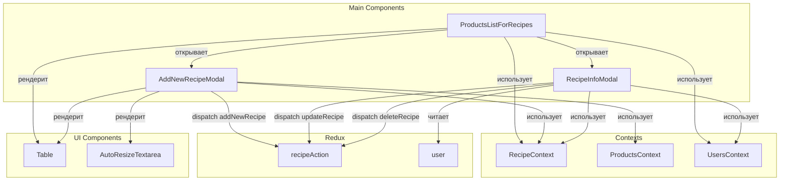
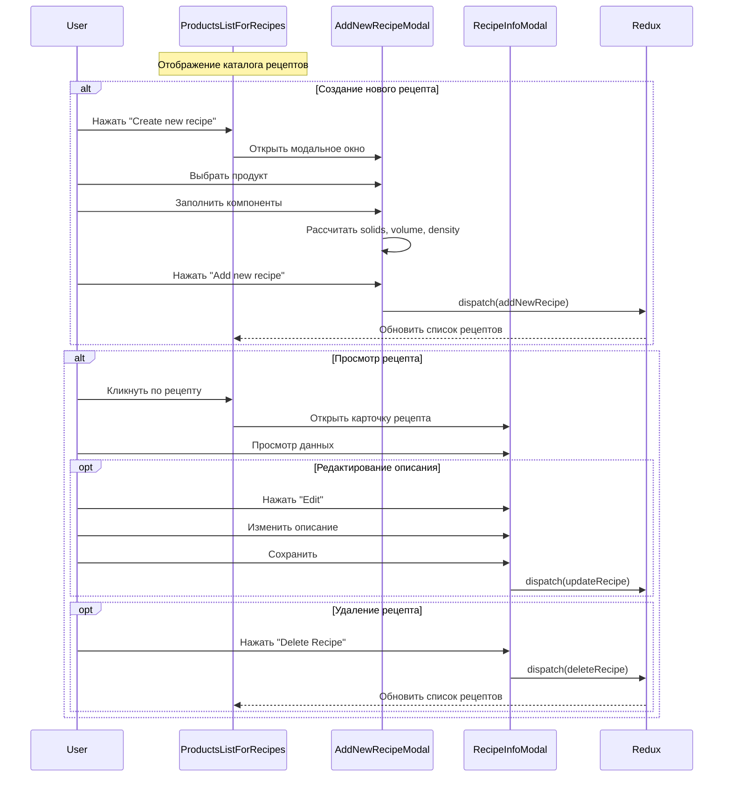

# Recipes

## Обзор

Комплекс компонентов для управления рецептами производства автоклавного газобетона (AAC). Включает:

- Просмотр каталога рецептов
- Создание новых рецептов с автоматическими расчетами
- Просмотр карточки рецепта
- Редактирование описания рецепта
- Удаление рецептов

## Схема взаимодействия компонентов



---

## Компонент 1: ProductsListForRecipes

### Роль в системе

Главный компонент для управления каталогом рецептов. Отвечает за:

- Отображение таблицы всех рецептов
- Открытие модального окна создания нового рецепта
- Открытие карточки рецепта при клике
- Управление правами доступа

### Зависимости

| Источник        | Назначение                                         |
| --------------- | -------------------------------------------------- |
| `RecipeContext` | Данные рецептов (`list_of_recipes`, `recipe_info`) |
| `UsersContext`  | Права доступа пользователя                         |
| `Redux (user)`  | Данные текущего пользователя                       |

### Ключевая логика

```javascript
const handlerRecipeInfo = useCallback((row) => {
  setSelectedRecipe(row.original);
  setModalShow(true);
}, []);

// Проверка прав доступа
useEffect(() => {
  if (user && roles.length > 0) {
    const access = checkUserAccess(user, roles, 'recipe_products');
    setUserAccess(access);

    if (!access?.canRead) {
      navigate('/');
    }
  }
}, [user, roles]);
```

### Визуальное представление

```
┌─────────────────────────────────────────────────────────────────────────┐
│                           Recipe Catalog                                 │
├─────────────────────────────────────────────────────────────────────────┤
│                                                      [Create new recipe] │
├───────────┬─────────────┬──────────┬──────────┬──────────┬─────────────┤
│ Article   │ Density     │ Cement   │ Lime     │ Sand     │ Alu Paste   │
├───────────┼─────────────┼──────────┼──────────┼──────────┼─────────────┤
│ M.00D300DE│ 300         │ 120.5    │ 85.3     │ 450.2    │ 0.45        │
│ M.00D400DE│ 400         │ 160.2    │ 95.1     │ 520.8    │ 0.52        │
└───────────┴─────────────┴──────────┴──────────┴──────────┴─────────────┘
```

---

## Компонент 2: AddNewRecipeModal

### Роль в системе

Модальное окно создания нового рецепта. Отвечает за:

- Выбор продукта (только испанского производства)
- Ввод компонентов рецепта
- Автоматический расчет Solids, Volume, Density, Water total
- Генерацию артикула рецепта
- Сохранение рецепта в базу данных

### Два режима работы

**Режим 1: Выбор продукта**

```jsx
{!haveProduct ? (
    <Table
        COLUMN_DATA={COLUMNS}
        dataOfTable={productsDataList}  // Только продукты из Spain
        handleRowClick={handlerAddProductRecipe}
    />
) : (
    // Форма ввода рецепта
)}
```

**Режим 2: Ввод компонентов рецепта**

### Структура рецепта

#### Основные поля

| Поле              | Описание                   | Единица измерения |
| ----------------- | -------------------------- | ----------------- |
| `cake_height`     | Высота массива             | м                 |
| `water_solids`    | Водо-твердое отношение     | -                 |
| `lime`            | Известь                    | кг                |
| `cement`          | Цемент                     | кг                |
| `aluminum_paste`  | Алюминиевая паста          | кг                |
| `return_dry`      | Возврат сухой              | кг                |
| `sand_slurry_dry` | Песчаная суспензия (сухая) | кг                |
| `sand_powder_dry` | Песчаный порошок (сухой)   | кг                |
| `gypsum_dry`      | Гипс (сухой)               | кг                |

### Ключевая логика расчетов

#### Разделение по плотности

В зависимости от плотности продукта используются разные наборы полей:

```javascript
// Для плотности > 100 кг/м³
const solidsNormalRequerideFields = [
  'lime',
  'cement',
  'sand_slurry_dry',
  'return_dry',
  'aluminum_paste',
  'aluminum_paste_2',
];

// Для плотности ≤ 100 кг/м³
const solidsOddRequerideFields = [
  'lime',
  'cement',
  'sand_powder_dry',
  'gypsum_dry',
  'return_dry',
  'aluminum_paste',
  'aluminum_paste_2',
];
```

#### Расчет Solids (сухие компоненты)

```javascript
const solids = useMemo(() => {
  return (
    (parseFloat(recipeInput.lime) || 0) +
    (parseFloat(recipeInput.cement) || 0) +
    (parseFloat(recipeInput.sand_slurry_dry) || 0) +
    (parseFloat(recipeInput.return_dry) || 0) +
    (parseFloat(recipeInput.aluminum_paste) || 0)
  ).toFixed(0);
}, [recipeInput]);
```

#### Расчет Volume (объем)

```javascript
const volume = useMemo(() => {
  if (!recipeInput.cake_height) return null;
  // Формула: высота * 6.262 * 1.58
  return (parseFloat(recipeInput.cake_height) * 6.262 * 1.58).toFixed(2);
}, [recipeInput?.cake_height]);
```

#### Расчет Density (плотность по рецепту)

```javascript
const density_recipe = useMemo(() => {
  if (!volume || !solids) return null;
  // Формула: (solids / volume) * 1.06
  return ((solids / volume) * 1.06).toFixed(0);
}, [volume, solids]);
```

#### Расчет Produced Return Dry (произведенный возврат)

```javascript
const producedReturnDry = useMemo(() => {
  if (!volume || !solids) return null;

  // Разные формулы для разной ширины продукта
  if (selectedProduct?.width == 85) {
    return ((volume - 5.364) * (solids / volume)).toFixed(0);
  } else if (selectedProduct?.width == 75) {
    return ((volume - 5.31) * (solids / volume)).toFixed(0);
  } else {
    return ((volume - 5.4) * (solids / volume)).toFixed(0);
  }
}, [volume, solids]);
```

#### Расчет Water Total (общее количество воды)

```javascript
const water_total = useMemo(() => {
  if (!recipeInput.water_solids || !solids) return null;
  return (solids * parseFloat(recipeInput?.water_solids)).toFixed(0);
}, [solids, recipeInput?.water_solids]);
```

### Генерация артикула рецепта

```javascript
const recipeArticle = () => {
  // Формат: M.00D{density}{certificate}{номер}
  // Пример: M.00D300DE000001

  let versionNumber = '000001';
  const articleId =
    list_of_recipes.length === 0
      ? 1
      : parseInt(
          list_of_recipes[list_of_recipes.length - 1].article.slice(-6),
        ) + 1;

  versionNumber = `0000000${articleId}`.slice(-6);
  const recipe_article = `M.00D${selectedProduct?.density}${selectedProduct?.certificate}${versionNumber}`;

  return recipe_article;
};
```

### AutoResizeTextarea компонент

Автоматически расширяющееся текстовое поле для описания:

```javascript
const AutoResizeTextarea = ({ value, onChange, ...props }) => {
    const textareaRef = useRef(null);

    useEffect(() => {
        if (textareaRef.current) {
            textareaRef.current.style.height = 'auto';
            textareaRef.current.style.height = `${textareaRef.current.scrollHeight}px`;
        }
    }, [value]);

    return <textarea ref={textareaRef} value={value} onChange={onChange} ... />;
};
```

### Валидация формы

```javascript
const addRecipeHandler = async () => {
  // Проверка Cake Height
  if (!recipeInput.cake_height || isNaN(parseFloat(recipeInput.cake_height))) {
    alert('Please fill in the Cake Height field');
    return;
  }

  // Проверка всех обязательных полей
  const isFormValid = requiredFields.every((field) => {
    const value = recipeInput[field];
    return (
      value !== undefined &&
      value !== null &&
      value !== '' &&
      !isNaN(parseFloat(value))
    );
  });

  if (!isFormValid) {
    alert('Please fill in all required fields');
    return;
  }

  // Сохранение рецепта...
};
```

---

## Компонент 3: RecipeInfoModal

### Роль в системе

Модальное окно с полной информацией о рецепте ("карточка рецепта"). Отвечает за:

- Отображение всех параметров рецепта
- Редактирование описания рецепта (inline editing)
- Удаление рецепта (с проверкой прав)

### Структура отображения

```jsx
<Row>
    <Col xs={8}>
        {/* Основные поля рецепта */}
        <Table>
            {mainFields.map((el) => (
                <tr>
                    <td><strong>{el.Header}</strong></td>
                    <td>
                        {editingField === el.accessor ? (
                            // Режим редактирования
                            <div className="d-flex gap-2">
                                <Form.Control value={editValue} onChange={...} />
                                <Button onClick={() => handleSave()}>✓</Button>
                                <Button onClick={handleCancel}>✕</Button>
                            </div>
                        ) : (
                            // Режим просмотра
                            <div className="d-flex justify-content-between">
                                <span>{props.selectedRecipe[el.accessor] || 'Empty'}</span>
                                {el.accessor === EDITABLE_FIELD && (
                                    <Button onClick={() => handleEditClick()}>Edit</Button>
                                )}
                            </div>
                        )}
                    </td>
                </tr>
            ))}
        </Table>
    </Col>

    <Col xs={4}>
        {/* Расчетные поля */}
        <Table className="bg-light">
            <tr><td><strong>Solids, kg</strong></td><td>{solids}</td></tr>
            <tr><td><strong>Volume, m³</strong></td><td>{volume}</td></tr>
            <tr><td><strong>Density, kg/m³</strong></td><td>{density_recipe}</td></tr>
            <tr><td><strong>Produced return (dry), kg</strong></td><td>{produced_return_dry}</td></tr>
            <tr><td><strong>Water total, kg</strong></td><td>{water_total}</td></tr>
        </Table>
    </Col>
</Row>
```

### Inline редактирование

```javascript
const EDITABLE_FIELD = 'description';

const handleEditClick = (fieldAccessor, currentValue) => {
  setEditingField(fieldAccessor);
  setEditValue(currentValue || '');
};

const handleSave = (fieldAccessor) => {
  const recipe = {
    id: props.selectedRecipe.id,
    description: editValue,
  };
  dispatch(updateRecipe(recipe));
  props.setSelectedRecipe({
    ...props.selectedRecipe,
    description: editValue,
  });
  setEditingField(null);
};
```

---

## Права доступа

Все компоненты используют систему прав из `UsersContext`:

| Право      | Назначение                                   |
| ---------- | -------------------------------------------- |
| `canRead`  | Просмотр каталога рецептов и карточек        |
| `canWrite` | Создание, редактирование и удаление рецептов |

```javascript
useEffect(() => {
  if (user && roles.length > 0) {
    const access = checkUserAccess(user, roles, 'recipe_products');
    setUserAccess(access);

    if (!access?.canRead) {
      navigate('/');
    }
  }
}, [user, roles]);
```

---

## Формулы расчетов

### Геометрические константы

```
Площадь формы = 6.262 × 1.58 = 9.89396 м²
```

### Основные формулы

| Параметр            | Формула                                          |
| ------------------- | ------------------------------------------------ |
| Volume              | `cake_height × 6.262 × 1.58`                     |
| Solids              | `lime + cement + sand + return + aluminum_paste` |
| Density (recipe)    | `(solids / volume) × 1.06`                       |
| Water total         | `solids × water_solids`                          |
| Produced return dry | `(volume - base_volume) × (solids / volume)`     |

### Базовая высота для Produced Return Dry

| Ширина продукта | Базовая высота |
| --------------- | -------------- |
| 85 мм           | 5.364 м³       |
| 75 мм           | 5.31 м³        |
| другие          | 5.4 м³         |

---

## Визуальное представление

### Карточка рецепта (RecipeInfoModal)

```
┌─────────────────────────────────────────────────────────────────────────────┐
│                           Recipe card                                 [X]   │
├─────────────────────────────────────────────────────────────────────────────┤
│ M.00D300DE000001                                                           │
├─────────────────────────────────────┬───────────────────────────────────────┤
│                                     │ ┌─────────────────────────────────┐   │
│ ┌─────────────────────────────────┐ │ │ Solids, kg              : 850   │   │
│ │ Lime (kg)           : 85.3      │ │ │ Volume, m³              : 2.85  │   │
│ │ Cement (kg)         : 120.5     │ │ │ Density, kg/m³          : 316   │   │
│ │ Sand Slurry (kg)    : 450.2     │ │ │ Produced return (dry)   : 45.2  │   │
│ │ Return Dry (kg)     : 15.0      │ │ │ Water total, kg         : 1250  │   │
│ │ Aluminum Paste (kg) : 0.45      │ │ └─────────────────────────────────┘   │
│ │ Water Solids        : 1.47      │ │                                       │
│ │ Cake Height (m)     : 0.288     │ │                                       │
│ │ Description         : Стандарт  │ │                                       │
│ └─────────────────────────────────┘ │                                       │
├─────────────────────────────────────┴───────────────────────────────────────┤
│                                                      [Delete Recipe] [Close] │
└─────────────────────────────────────────────────────────────────────────────┘
```

---

## Последовательность работы



---

## Пример использования

```jsx
import ProductsListForRecipes from '#components/Recipe/ProductsListForRecipes';

function RecipesPage() {
  return (
    <RecipeContextProvider>
      <ProductsContextProvider>
        <UsersContextProvider>
          <ProductsListForRecipes />
        </UsersContextProvider>
      </ProductsContextProvider>
    </RecipeContextProvider>
  );
}
```

---

## Связанные компоненты

- [`ProductsListForRecipes`](02-components/06-recipes/ProductsListForRecipes) - главный компонент
- [`AddNewRecipeModal`](02-components/06-recipes/AddNewRecipeModal) - создание рецептов
- [`RecipeInfoModal`](02-components/06-recipes/RecipeInfoModal) - карточка рецепта

---

## Планы по развитию

- [ ] Добавить копирование рецептов
- [ ] Реализовать сравнение рецептов
- [ ] Добавить импорт/экспорт рецептов
- [ ] Поддержка версионирования рецептов
- [ ] Добавить калькулятор корректировки рецепта
