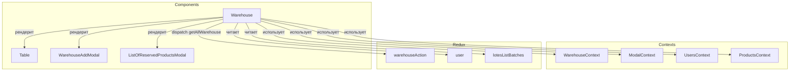

# Warehouse

## Роль в системе

Компонент управления складскими запасами. Отвечает за:

- Отображение таблицы складских остатков с расширенной информацией
- Фильтрацию записей (скрытие нулевых остатков)
- Добавление новой продукции на склад
- Просмотр зарезервированных продуктов
- Расчет объема продукции в кубических метрах (м³)
- Интеграцию с данными о партиях (batch_id)

## Схема взаимодейщения



## Зависимости

### Contexts

| Источник           | Назначение                                        |
| ------------------ | ------------------------------------------------- |
| `WarehouseContext` | Данные склада (`warehouse_data`), колонки таблицы |
| `ModalContext`     | Управление модальными окнами склада               |
| `UsersContext`     | Права доступа пользователя                        |
| `ProductsContext`  | Справочник продуктов (`latestProducts`)           |

### Redux

| Источник           | Назначение                                         |
| ------------------ | -------------------------------------------------- |
| `warehouseAction`  | Действия для работы со складом (`getAllWarehouse`) |
| `user`             | Данные текущего пользователя                       |
| `lotesListBatches` | Данные о партиях для получения даты производства   |

## Ключевая логика

### Расширение данных склада

Компонент обогащает данные склада дополнительной информацией:

```javascript
const extendedWarehouseData = useMemo(() => {
  if (!warehouse_data || !latestProducts) return warehouse_data || [];

  const processedData = warehouse_data.map((item) => {
    // Поиск продукта по артикулу
    const product = latestProducts.find(
      (product) => product.article === item.product_article,
    );

    // Расчет объема в м³
    const m3Value = product?.volumeBlockOnPallet || 0;
    const totalQuantity = item.total_quantity || 0;
    const total_m3 = Math.round(m3Value * totalQuantity * 100) / 100;

    // Получение даты производства из данных о партиях
    const production_date = item?.batch_id
      ? lotesListBatches.find((batch) => batch?.batch_id == item?.batch_id)
          ?.production_date
      : null;

    return {
      ...item,
      total_m3,
      production_date,
    };
  });

  // Фильтрация по состоянию переключателя
  if (hideZeroQuantity) {
    return processedData.filter((item) => item.total_quantity > 0);
  }

  return processedData;
}, [warehouse_data, latestProducts, hideZeroQuantity, lotesListBatches]);
```

**Расчет объема (total_m3):**

```javascript
total_m3 = volumeBlockOnPallet * total_quantity;
// Округление до 2 знаков
Math.round(total_m3 * 100) / 100;
```

### Фильтрация нулевых остатков

```javascript
const [hideZeroQuantity, setHideZeroQuantity] = useState(false);

// Переключатель для фильтрации
<FormControlLabel
  control={
    <Switch
      checked={hideZeroQuantity}
      onChange={(e) => setHideZeroQuantity(e.target.checked)}
    />
  }
  label="Toggle to show empty entries"
/>;
```

При включении переключателя из таблицы скрываются позиции с `total_quantity === 0`.

### Загрузка данных

```javascript
useEffect(() => {
  dispatch(getAllWarehouse());
}, []);
```

Данные склада загружаются при монтировании компонента.

## Права доступа

```javascript
useEffect(() => {
  if (user && roles.length > 0) {
    const access = checkUserAccess(user, roles, 'Warehouse');

    if (JSON.stringify(access) !== JSON.stringify(userAccess)) {
      setUserAccess(access);
    }
  }
}, [user, roles, checkUserAccess, userAccess, setUserAccess]);
```

Права определяют:

- Возможность добавления новой продукции (`userAccess?.canWrite`)
- Возможность просмотра склада (`userAccess?.canRead`)

## Структура данных

### Исходные данные склада (warehouse_data)

```javascript
{
    id: number,                    // ID записи на складе
    product_article: string,       // Артикул продукта
    total_quantity: number,        // Общее количество на складе
    free_quantity_remaining: number, // Свободный остаток
    ordered_quantity: number,      // Зарезервированное количество
    batch_id: string,              // ID партии
    // ... другие поля
}
```

### Расширенные данные (extendedWarehouseData)

```javascript
{
    ...warehouse_data_item,
    total_m3: number,              // Общий объем в м³ (рассчитанный)
    production_date: string,       // Дата производства (из lotesListBatches)
}
```

### Колонки таблицы (COLUMNS_WAREHOUSE)

Определяются в `WarehouseContext` и могут включать:

| Колонка                 | Описание                         |
| ----------------------- | -------------------------------- |
| product_article         | Артикул продукта                 |
| total_quantity          | Общее количество (паллеты/штуки) |
| total_m3                | Объем в м³                       |
| free_quantity_remaining | Свободный остаток                |
| ordered_quantity        | Зарезервировано                  |
| batch_id                | Номер партии                     |
| production_date         | Дата производства                |

## Вложенные компоненты

| Компонент                     | Назначение                                           |
| ----------------------------- | ---------------------------------------------------- |
| `Table`                       | Универсальная таблица для отображения данных         |
| `WarehouseAddModal`           | Модальное окно добавления продукции на склад         |
| `ListOfReservedProductsModal` | Модальное окно просмотра зарезервированных продуктов |

## API компонента

### Props

Компонент не принимает props, использует контексты.

### State

| Переменная         | Тип       | Начальное | Описание                         |
| ------------------ | --------- | --------- | -------------------------------- |
| `hideZeroQuantity` | `boolean` | `false`   | Флаг фильтрации нулевых остатков |

### Используемые actions

| Action            | Назначение                     |
| ----------------- | ------------------------------ |
| `getAllWarehouse` | Загрузка всех данных со склада |

## Обработчики событий

### handleRowClick

```javascript
const handleRowClick = useCallback((row) => {
  setWarehouseInfoCurIdModal(row.original.id);
  setWarehouseInfoModal(!warehouseInfoModal);
}, []);
```

Открывает модальное окно с информацией о зарезервированных продуктах для выбранной позиции.

### Добавление продукции

```javascript
<Table
  onClickButton={() => {
    setWarehouseModal(!warehouseModal);
  }}
  buttonText={'Add new product on warehouse'}
  // ...
/>
```

Кнопка добавления отображается только если `userAccess?.canWrite === true`.

## Пример использования

```jsx
import Warehouse from '#components/Warehouse/Warehouse';

function WarehousePage() {
  return (
    <WarehouseContextProvider>
      <ModalContextProvider>
        <UsersContextProvider>
          <ProductsContextProvider>
            <Warehouse />
          </ProductsContextProvider>
        </UsersContextProvider>
      </ModalContextProvider>
    </WarehouseContextProvider>
  );
}
```

## Визуальное представление

```
┌─────────────────────────────────────────────────────────────┐
│ ☑ Toggle to show empty entries                              │
├─────────────────────────────────────────────────────────────┤
│ ┌─────────────────────────────────────────────────────────┐ │
│ │                    Warehouse Table                      │ │
│ │ ┌─────────┬───────┬────────┬─────────┬───────────────┐  │ │
│ │ │ Article │ Qty   │ m³     │ Free    │ Ordered       │  │ │
│ │ ├─────────┼───────┼────────┼─────────┼───────────────┤  │ │
│ │ │ BLOCK01 │ 150   │ 12.5   │ 120     │ 30            │  │ │
│ │ │ BLOCK02 │ 0     │ 0      │ 0       │ 0             │  │ │
│ │ │ MIX01   │ 80    │ 6.4    │ 80      │ 0             │  │ │
│ │ └─────────┴───────┴────────┴─────────┴───────────────┘  │ │
│ │                                                   [Add] │ │
│ └─────────────────────────────────────────────────────────┘ │
└─────────────────────────────────────────────────────────────┘
```

## Важные замечания

### Оптимизация производительности

- Использование `useMemo` для вычисления `extendedWarehouseData` предотвращает лишние пересчеты
- `useCallback` для `handleRowClick` сохраняет ссылку на функцию

### Зависимости расширенных данных

```javascript
useMemo(() => {
  // Пересчет происходит только при изменении:
}, [warehouse_data, latestProducts, hideZeroQuantity, lotesListBatches]);
```

### Обработка отсутствия данных

```javascript
if (!warehouse_data || !latestProducts) return warehouse_data || [];
```

При отсутствии данных возвращается пустой массив или исходные данные.

### Интеграция с партиями

Дата производства подтягивается из `lotesListBatches` по `batch_id`. Это позволяет отслеживать возраст продукции на складе.

## Связанные компоненты

- [`WarehouseAddModal`](02-components/03-warehouse/WarehouseAddModal) - добавление продукции
- [`ListOfReservedProductsModal`](02-components/03-warehouse/ListOfReservedProductsModal) - просмотр резервов
- [`Table`](02-components/00-common/Table) - универсальная таблица
- [`Products`](02-components/04-products/Products) - справочник продуктов

## Планы по развитию

- [ ] Добавить сортировку по дате производства
- [ ] Реализовать экспорт данных в Excel
- [ ] Добавить фильтр по типу продукции
- [ ] Интегрировать уведомления о критических остатках
