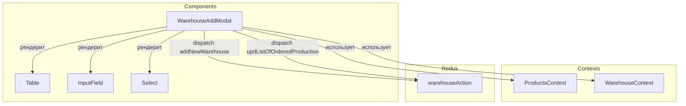
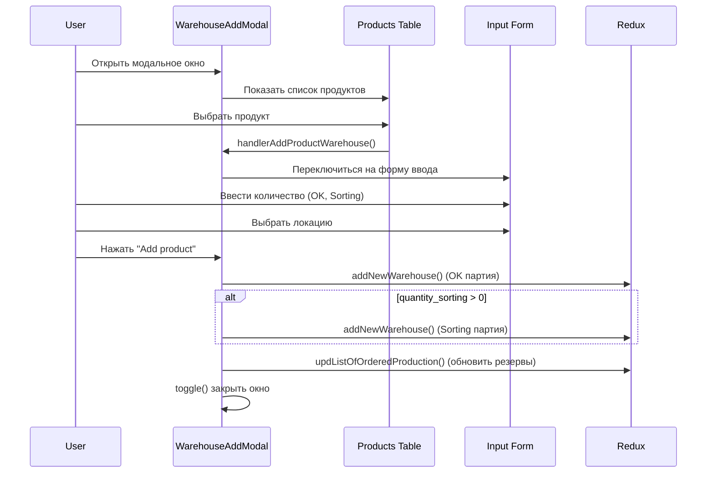

# WarehouseAddModal

## Роль в системе

Модальное окно для добавления новой продукции на склад. Отвечает за:

- Выбор продукта из справочника
- Ввод параметров поступления (количество OK, сортировка)
- Автоматическое резервирование под существующие заказы
- Создание записей на складе (основная + сортировочная)

## Схема взаимодействия



## Зависимости

### Contexts

| Источник           | Назначение                                                                                              |
| ------------------ | ------------------------------------------------------------------------------------------------------- |
| `ProductsContext`  | Справочник продуктов (`latestProducts`, `COLUMNS`)                                                      |
| `WarehouseContext` | Список заказанной продукции (`list_of_ordered_production`), генерация артикула, колонки модального окна |

### Redux Actions

| Action                       | Назначение                       |
| ---------------------------- | -------------------------------- |
| `addNewWarehouse`            | Добавление новой записи на склад |
| `updListOfOrderedProduction` | Обновление резервов под заказы   |

## Ключевая логика

### Основной поток добавления

```javascript
const addProductOrder = async () => {
  const { product_article, quantity_ok, quantity_sorting } = warehouseData;
  const free_quantity_remaining = quantity_ok;
  const ordered_quantity = 0;

  // 1. Фильтруем резервы для текущего продукта
  const reservedProducts =
    list_of_ordered_production?.filter(
      (item) => item.product_article === product_article,
    ) || [];

  // 2. Корректируем остатки под существующие резервы
  let remainingFreeQty = parseInt(free_quantity_remaining);
  let summReserve = 0;

  const updatedReserves = reservedProducts.map((reservedItem) => {
    // Расчет сколько можно зарезервировать из нового товара
    const deducted = Math.min(
      reservedItem.quantity -
        reservedItem.quantity_in_warehouse -
        parseInt(ordered_quantity),
      remainingFreeQty,
    );

    remainingFreeQty -= deducted;
    summReserve += deducted;

    return {
      ...reservedItem,
      quantity_in_warehouse:
        reservedItem.quantity_in_warehouse +
        parseInt(ordered_quantity) +
        deducted,
    };
  });

  // 3. Добавляем основную партию (OK)
  dispatch(
    addNewWarehouse({
      ...dataWithoutDescription,
      sorting: 0,
      free_quantity_remaining: remainingFreeQty,
      ordered_quantity: parseInt(ordered_quantity) + summReserve,
      total_quantity:
        parseInt(ordered_quantity) + summReserve + remainingFreeQty,
      type: 'OK',
    }),
  );

  // 4. Добавляем сортировочную партию (если есть)
  if (quantity_sorting > 0) {
    dispatch(
      addNewWarehouse({
        ...dataWithoutDescription,
        free_quantity_remaining: 0,
        ordered_quantity: 0,
        total_quantity: quantity_sorting,
        sorting: quantity_sorting,
        type: 'Sorting',
      }),
    );
  }

  // 5. Обновляем резервы
  for (const ordered_production of updatedReserves) {
    await dispatch(updListOfOrderedProduction(ordered_production));
  }

  setWarehouseData({});
  toggle();
};
```

### Логика резервирования

При добавлении нового товара на склад, система автоматически резервирует его под существующие заказы:

```javascript
// Алгоритм распределения:
// 1. Найти все резервы для данного product_article
// 2. Для каждого резерва рассчитать необходимый остаток
// 3. Списать из нового товара столько, сколько нужно для покрытия резерва
// 4. Обновить quantity_in_warehouse в резервах
// 5. Оставшееся количество записать как free_quantity_remaining
```

**Визуализация распределения:**

```
Новый товар: 100 паллет
Существующие резервы:
├── Заказ A: нужно 30 паллет → резервируем 30
├── Заказ B: нужно 50 паллет → резервируем 50
└── Заказ C: нужно 40 паллет → резервируем 20 (остаток)

Результат:
├── free_quantity_remaining: 0
├── ordered_quantity: 100
└── Резервы обновлены
```

### Выбор продукта

```javascript
const handlerAddProductWarehouse = useCallback(
  (row) => {
    const product = latestProducts.find((el) => el.id === row.original.id);
    const warehouse_article = getWarehouseArticle(product);
    const description = extractProductTitle(product?.description);

    setWarehouseData((prev) => ({
      ...prev,
      product_article: product.article,
      description,
      article: warehouse_article,
    }));
  },
  [latestProducts, getWarehouseArticle],
);
```

### Извлечение названия продукта

```javascript
function extractProductTitle(description) {
  if (!description) return '';
  // Извлекает текст между "BAUBLOCK®" и "Medidas"
  const match = description.match(/BAUBLOCK®\s*(.+?)\s*(?:Medidas|$)/i);
  if (match && match[1]) {
    return match[1].trim();
  }
  return description;
}
```

## Структура данных

### warehouseData (состояние формы)

```javascript
{
    product_article: string,       // Артикул продукта
    article: string,               // Складской артикул (сгенерированный)
    description: string,           // Описание продукта
    quantity_ok: number,           // Количество годной продукции
    quantity_sorting: number,      // Количество на сортировку
    warehouse_loc: string,         // Локация склада ('local' | 'remote')
    type: string                   // Тип ('OK' | 'Remnants' | 'Sorting')
}
```

### Поля ввода (COLUMNS_WAREHOUSE_ADD_MODAL)

| Поле               | Тип             | Описание                    |
| ------------------ | --------------- | --------------------------- |
| `product_article`  | text (readonly) | Артикул продукта            |
| `article`          | text (readonly) | Сгенерированный артикул     |
| `description`      | text (readonly) | Описание                    |
| `quantity_ok`      | number          | Количество годной продукции |
| `quantity_sorting` | number          | Количество на сортировку    |
| `warehouse_loc`    | select          | Локация склада              |
| `type`             | select          | Тип продукции               |

## Компоненты модального окна

### Два режима отображения

**Режим 1: Выбор продукта**

```jsx
{!haveProduct ? (
    <Table
        COLUMN_DATA={COLUMNS}
        dataOfTable={latestProducts}
        handleRowClick={handlerAddProductWarehouse}
    />
) : (
    // Форма ввода параметров
)}
```

**Режим 2: Ввод параметров**

```jsx
{
  COLUMNS_WAREHOUSE_ADD_MODAL.map((el) => {
    // Пропускаем sorting, total_m3, type, product_article
    if (
      el.accessor === 'sorting' ||
      el.accessor === 'total_m3' ||
      el.accessor === 'type' ||
      el.accessor === 'product_article'
    ) {
      return;
    }

    // Только для чтения (article, product_article)
    if (el.accessor === 'article' || el.accessor === 'product_article') {
      return <input readOnly />;
    }

    // Выпадающий список для warehouse_loc
    if (el.accessor === 'warehouse_loc') {
      return <Select options={warehouseLocOpt} />;
    }

    // Обычные поля ввода
    return <InputField />;
  });
}
```

## Опции выбора

### Локация склада

```javascript
const warehouseLocOpt = [
  { value: 'local', label: 'Local' },
  { value: 'remote', label: 'Remote' },
];
```

### Тип продукции

```javascript
const type_select = [
  { value: 'OK', label: 'OK' },
  { value: 'Remnants', label: 'Remnants' },
  { value: 'Sorting', label: 'Sorting' },
];
```

## API компонента

### Props

| Prop                | Тип        | Обязательный | Описание                                |
| ------------------- | ---------- | ------------ | --------------------------------------- |
| `isOpen`            | `boolean`  | Да           | Состояние открытия модального окна      |
| `toggle`            | `function` | Да           | Функция переключения состояния          |
| `COLUMNS_WAREHOUSE` | `array`    | Да           | Конфигурация колонок для таблицы склада |

### State

| Переменная      | Тип      | Начальное | Описание          |
| --------------- | -------- | --------- | ----------------- |
| `warehouseData` | `object` | `[]`      | Данные формы      |
| `warehouse_loc` | `string` | `'local'` | Выбранная локация |

## Вложенные компоненты

| Компонент    | Назначение                             |
| ------------ | -------------------------------------- |
| `Table`      | Таблица выбора продукта из справочника |
| `InputField` | Поле ввода с валидацией                |
| `Select`     | Выпадающий список (react-select)       |

## Последовательность работы



## Пример использования

```jsx
import WarehouseAddModal from '#components/Warehouse/WarehouseAddModal';

function WarehousePage() {
  const [modalOpen, setModalOpen] = useState(false);
  const { COLUMNS_WAREHOUSE } = useWarehouseContext();

  return (
    <>
      <button onClick={() => setModalOpen(true)}>Add product</button>

      <WarehouseAddModal
        isOpen={modalOpen}
        toggle={() => setModalOpen(false)}
        COLUMNS_WAREHOUSE={COLUMNS_WAREHOUSE}
      />
    </>
  );
}
```

## Важные замечания

### Автоматическое резервирование

При добавлении нового товара система **автоматически** резервирует его под существующие заказы. Это ключевая бизнес-логика, обеспечивающая актуальность складских остатков.

### Две записи на склад

При наличии сортировочной продукции создаются **две отдельные записи**:

1. OK продукция (свободный остаток, может резервироваться)
2. Sorting продукция (заблокирована, не участвует в резервировании)

### Оптимизация

Компонент обернут в `React.memo()` для предотвращения лишних перерендеров.

### Валидация

Перед добавлением рекомендуется добавить валидацию:

- Проверка на отрицательные значения
- Проверка на пустые поля
- Проверка на максимальное значение

## Связанные компоненты

- [`Warehouse`](02-components/03-warehouse/Warehouse) - основная страница склада
- [`Table`](02-components/00-common/Table) - таблица выбора продуктов
- [`InputField`](02-components/00-common/InputField) - поле ввода

## Планы по развитию

- [ ] Добавить валидацию полей
- [ ] Поддержка сканирования штрих-кодов
- [ ] Предпросмотр резервов перед добавлением
- [ ] Поддержка множественного добавления
